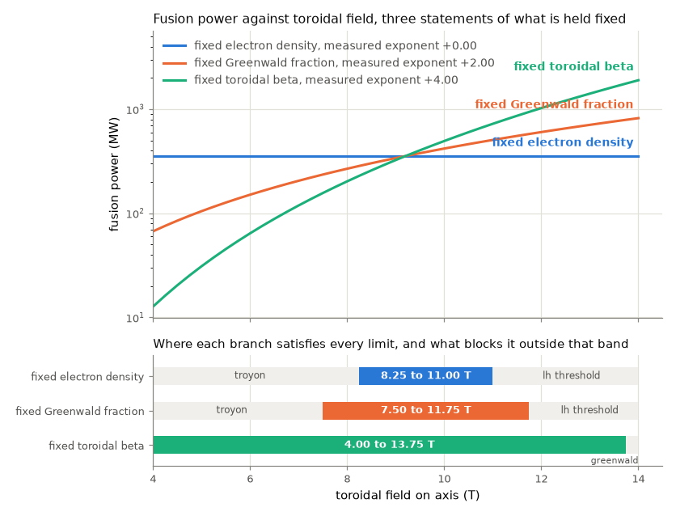
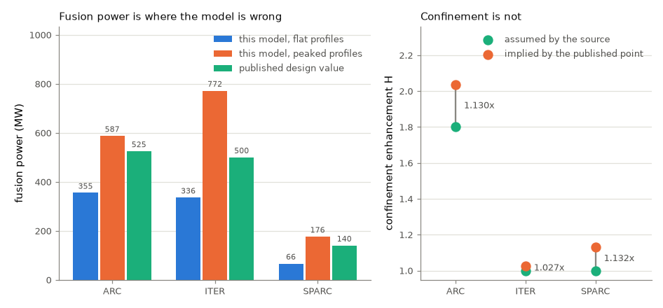
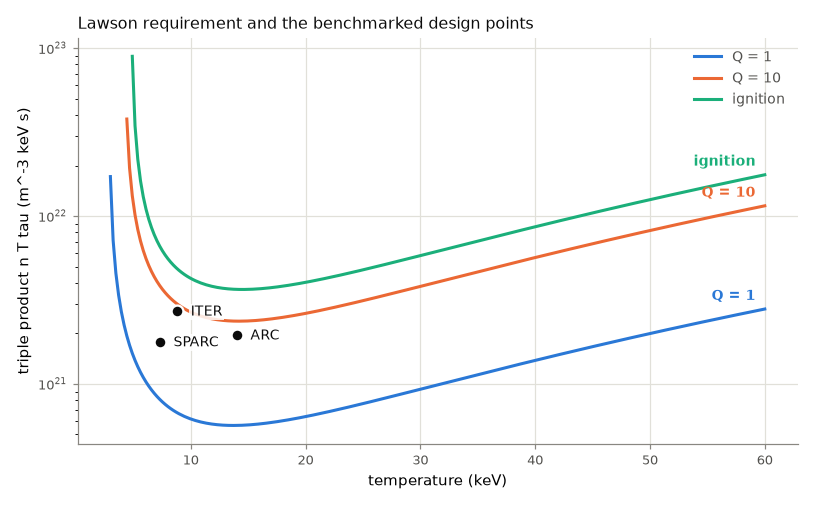

# Arc Reactor Benchmark

Power balance and confinement benchmarking for ARC-class compact high-field tokamaks with a parametric efficiency study.

[](https://github.com/Eelis03/arc-reactor-benchmark/actions/workflows/ci.yml)
[](https://www.python.org/downloads/)
[](LICENSE)



That figure is the compact high-field argument stated as a number. The three
curves are the same device swept over the same field with the same solver, and
they differ only in what is declared fixed while the field rises. That single
choice moves the measured exponent of fusion power in field from 0 to 2 to 4. The
lower panel is the part the exponent alone does not tell you: every branch is
feasible only over a band. The two shallower ones are blocked below by the Troyon
beta limit and above by the power a plasma needs just to reach H-mode, and the
steepest one runs nearly the whole sweep before the Greenwald density limit stops
it at 14 T.

**ARC here means the Affordable, Robust, Compact tokamak** of Sorbom and
colleagues, published in Fusion Engineering and Design in 2015: a peer-reviewed
engineering design for a compact high-field fusion pilot plant with demountable
rare earth barium copper oxide toroidal field magnets and a molten salt liquid
immersion blanket. It is not the fictional device of a similar nickname, and
nothing in this repository has any relationship to that.

This package solves a zero-dimensional deuterium tritium power balance, evaluates
the operational limits a design point has to respect, converts the result into
net electrical output, and compares all of it against three published design
points: ARC, ITER, and SPARC.

## The benchmark, including the parts that do not flatter it

From `uv run python examples/benchmark_points.py`, with flat profiles, the
IPB98(y,2) scaling, the separatrix loss power convention, and a first wall
reflectivity of 0.9. The published values are design targets from the cited
papers, not measurements: none of the three machines has operated at these
points.

The two worst rows are the ones worth reading first. This model puts the ARC
fusion gain at 3.16 against a published 13.6, and its net electrical output at
-6.9 MWe against a published 190.

| Machine | Quantity | Computed | Published | Error |
| --- | --- | --- | --- | --- |
| ARC | fusion power, MW | 355.1 | 525.0 | -32.4 percent |
| ARC | fusion gain Q | 3.16 | 13.6 | -76.7 percent |
| ARC | auxiliary power, MW | 112.2 | 38.6 | +190.7 percent |
| ARC | normalised beta | 2.250 | 2.590 | -13.1 percent |
| ARC | bootstrap fraction | 0.647 | 0.630 | +2.7 percent |
| ARC | Greenwald fraction | 0.669 | 0.670 | -0.2 percent |
| ARC | thermal power, MW | 552.6 | 708.0 | -22.0 percent |
| ARC | net electric power, MWe | -6.9 | 190.0 | -103.6 percent |
| ITER | fusion power, MW | 335.6 | 500.0 | -32.9 percent |
| ITER | fusion gain Q | 3.66 | 10.0 | -63.4 percent |
| ITER | confinement time, s | 3.090 | 3.700 | -16.5 percent |
| ITER | auxiliary power, MW | 91.7 | 50.0 | +83.4 percent |
| ITER | normalised beta | 1.693 | 1.800 | -5.9 percent |
| ITER | bootstrap fraction | 0.224 | 0.150 | +49.4 percent |
| ITER | Greenwald fraction | 0.838 | 0.850 | -1.4 percent |
| SPARC | fusion power, MW | 66.4 | 140.0 | -52.6 percent |
| SPARC | fusion gain Q | 1.84 | 11.0 | -83.3 percent |
| SPARC | confinement time, s | 0.788 | 0.770 | +2.3 percent |
| SPARC | auxiliary power, MW | 36.2 | 11.0 | +229.0 percent |
| SPARC | Greenwald fraction | 0.364 | 0.370 | -1.7 percent |

The agreements and the disagreements separate cleanly, and the pattern is more
informative than any single row.

Quantities that are closed forms of the machine parameters are reproduced to
within two percent: the Greenwald fraction is out by 0.2, 1.4, and 1.7 percent
for the three machines. Quantities that depend on the pressure are out by five to
thirteen percent, which is the size of the profile and fast alpha contributions
this model does not carry. The bootstrap fraction agrees for ARC to 2.7 percent
and is 49 percent high for ITER, which is what a single coefficient of 0.7 in
`f_BS = c sqrt(eps) beta_p` does when applied across a factor of seven in
poloidal beta.

The fusion power is 32 to 53 percent low everywhere, and the fusion gain is 63 to
83 percent low, a larger error than the fusion power alone accounts for. The
auxiliary power is the difference between the transport loss and the alpha
heating, so an error in either lands on it, and the transport loss carries the
amplification exponent of 3.226 that the sensitivity section measures.

SPARC as published is reported as violating a constraint. Its solved loss power
of 31.8 MW sits below the 40.7 MW L to H access threshold, a shortfall of a
factor of 1.28, so the H-mode confinement time it was solved with is not
available to it under this model's own rules. That is recorded as a violation
rather than a footnote, and it is pinned as such in the regression tests.

## The diagnosis, which is what makes those numbers useful



A benchmark that reports a gain 77 percent low and stops there is a table. The
fusion gain conflates two different failures, and separating them is what turns
the discrepancy into information.

Take the published fusion power and the published auxiliary power as given, let
this model supply the stored energy and the radiated power, and ask what
confinement enhancement the scaling would need in order to reproduce that
operating point. That number is directly comparable with the H factor each source
assumes.

| Machine | H factor assumed by the source | H factor implied by the published point | Ratio |
| --- | --- | --- | --- |
| ARC | 1.800 | 2.035 | 1.130 |
| ITER | 1.000 | 1.027 | 1.027 |
| SPARC | 1.000 | 1.132 | 1.132 |

The confinement model therefore agrees with all three sources to within 13
percent, and with ITER to 2.7 percent. ITER is the point IPB98(y,2) was
constructed to project, so that agreement is a check that the scaling is
transcribed correctly rather than a claim about the model. Evaluated directly at
the ITER reference parameters at a loss power of 87 MW, this implementation
returns 3.59 s against the published 3.7 s, a difference of 2.9 percent, and the
published loss power is quoted between 80 and 90 MW across sources, which alone
moves the result from 3.81 s to 3.51 s. That is asserted in
`tests/test_confinement.py` rather than only stated here.

So the confinement model is not what is wrong. The gap is a fusion power problem,
and the fusion power problem has a known cause: `<n**2 sigma_v(T)>` exceeds
`<n>**2 sigma_v(<T>)` for any peaked profile, and a zero-dimensional model
evaluates the second. That is worth knowing precisely because it points at
something. A confinement disagreement of the same size would not.

The size of the profile effect is measured rather than argued about. A parabolic
shape with a density exponent of 0.4 and a temperature exponent of 1.0 enhances
fusion power by 1.654 and stored energy by 1.167 at 14 keV:

| Machine | Flat, MW | Peaked, MW | Published, MW |
| --- | --- | --- | --- |
| ARC | 355.1 | 587.4 | 525.0 |
| ITER | 335.6 | 771.8 | 500.0 |
| SPARC | 66.4 | 176.1 | 140.0 |

One shape moves ARC from 32 percent low to 12 percent high, ITER from 33 percent
low to 54 percent high, and SPARC from 53 percent low to 26 percent high. ARC's
normalised beta improves from 13 percent low to 1.4 percent high in the same
step. The shape that suits one machine overshoots another, which is the direct
statement that profile shape is a per-machine input and not a universal
correction. Choosing a shape per machine to reproduce the published fusion power
would turn a benchmark into a fit, so the flat case is what the primary table
reports and the peaked case is reported beside it.

Supplying a profile shape also fixes something that used to be left uncorrected.
The confinement scalings, the Greenwald limit, and the L to H power threshold are
all published against a line-averaged density, while a volume-averaged model
carries the volume average. For the parabolic family the ratio between the two is
closed form, and at a density exponent of 0.4 it is 1.1446, which raises the
IPB98(y,2) confinement time by 5.69 percent at a fixed loss power. That
correction is now applied wherever a published correlation is written in
line-averaged density. It is exactly one for a flat density, so no number in the
primary table moved. What was closed, what it cost, and what remains open is
recorded in [docs/design-notes.md](docs/design-notes.md).

## Installation

Requires Python 3.12 or later.

```bash
git clone https://github.com/Eelis03/arc-reactor-benchmark.git
cd arc-reactor-benchmark
uv sync
```

Using pip instead of uv:

```bash
python -m venv .venv
source .venv/bin/activate      # Windows: .venv\Scripts\activate
pip install -e ".[dev]"
```

## Running it

```python
from arc_benchmark import IPB98Y2, evaluate_constraints, machine, solve_operating_point

case = machine("ARC")
point = solve_operating_point(case.state, IPB98Y2)
report = evaluate_constraints(point)

print(f"fusion power   {point.terms.fusion_power_mw:.1f} MW")
print(f"auxiliary      {point.auxiliary_power_mw:.1f} MW")
print(f"fusion gain Q  {point.fusion_gain:.2f}")
print(f"binding limit  {report.binding.name} at {report.binding.utilisation:.3f}")
```

Swapping `IPB98Y2` for `PETTY08` or `ITER89P` is the only change needed to see the
same design point under a different confinement scaling, and swapping `"ARC"` for
`"ITER"` or `"SPARC"` is the only change needed to move to another machine.

Every measured number in this README is printed by one of these commands, or by
the test and coverage commands in the section on checking. Nothing is transcribed
from anywhere else:

```bash
uv run python examples/power_balance.py        # one design point, audited term by term
uv run python examples/benchmark_points.py     # the comparison against published values
uv run python examples/field_scaling.py        # field and size sweeps, with fitted exponents
uv run python examples/efficiency_study.py     # recirculating power and net electricity
uv run python examples/scaling_sensitivity.py  # the same point under three scalings
uv run python examples/readme_figures.py       # the three figures in this README
```

Each accepts `--quick` for a short run without figures, and the sweep scripts
accept `--points` to change the resolution. The examples are wiring only: the
dependency direction inside the package runs one way, from `model`, which knows
about nothing else, through `algorithm` and `pipeline` to `analysis`, and the
example scripts contain no physics of their own.

The three figures in this README are snapshots. The last command in that list is
the one that regenerates all of them: it writes them into `docs/figures` and
prints every number they draw, so that a caption can be checked against the
output rather than against the picture.
Continuous integration does not compare them byte for byte, because matplotlib
output is not byte reproducible across platforms, font stacks, and library
versions. What it does check is that the command still runs, that it still
produces all three files, and that they still fit inside the 250 KB the
repository budgets for them.

## Results

The default configuration throughout is flat profiles, the IPB98(y,2) scaling,
the separatrix loss power convention, and a first wall reflectivity of 0.9.

### Field scaling, quantified

From `uv run python examples/field_scaling.py`, 41 points from 4 T to 14 T at
fixed size and shape, with the plasma current tracked so that the cylindrical
safety factor stays at 5.004. This is the sweep the figure under the badges
draws.

| Held fixed | Fusion power exponent in field | Analytic expectation | Gain exponent | Confinement time exponent |
| --- | --- | --- | --- | --- |
| Electron density | +0.0000 | 0 | +2.5024 | +3.4839 |
| Greenwald fraction | +2.0000 | 2 | +3.2664 | +2.5806 |
| Toroidal beta | +4.0000 | 4 | +4.4189 | +1.6774 |

All three fits return a coefficient of determination of 1.000000, because the
underlying relation is an exact power law in each case. At fixed density the
field buys nothing directly in fusion power and everything through confinement.
At a fixed Greenwald fraction the density tracks the current, which tracks the
field, so fusion power goes as the square of the field. At fixed beta the density
goes as the square of the field and fusion power as the fourth power, which is
the branch the compact high-field case is normally argued on. The gain exponents
exceed the fusion power exponents in every case, because raising the field also
lengthens the confinement time and so reduces the heating required.

Which limit binds first depends on the direction:

| Held fixed | Feasible points | Binding constraint tally | Where it fails |
| --- | --- | --- | --- |
| Electron density | 12 of 41, from 8.25 T to 11.00 T | Troyon at 25, L to H threshold at 16 | Troyon, Greenwald, and bootstrap below 8.25 T; L to H threshold above 11.00 T |
| Greenwald fraction | 18 of 41, from 7.50 T to 11.75 T | Troyon at 27, L to H threshold at 14 | Troyon and bootstrap below 7.50 T; L to H threshold above 11.75 T |
| Toroidal beta | 40 of 41, from 4.00 T to 13.75 T | Troyon at 29, Greenwald at 12 | Greenwald and the L to H threshold at 14.00 T |

The fixed-beta branch is not only the steepest, it is also the one that stays
feasible longest, because holding beta constant is precisely holding the Troyon
constraint at a fixed utilisation while the field rises. Its failure at 14 T is
the Greenwald limit: the density needed to hold beta at that field exceeds what
the current density supports.

Sweeping the major radius instead, from 2 m to 8 m at fixed aspect ratio, field,
and safety factor, gives a fusion power exponent of +1.0000 against the analytic
expectation of 1. The volume goes as the cube of the radius while the Greenwald
density falls as its inverse, and fusion power carries the square of the density.
Only 12 of 41 points are feasible, the lowest at 2.75 m and the highest at
4.40 m: Troyon and the bootstrap fraction fail below that band and the L to H
access threshold fails above it. That threshold is the binding constraint at 28
of the 41 points, because a large device at a fixed Greenwald fraction has a long
confinement time, therefore a low loss power, and therefore cannot reach H-mode.

### Net electrical efficiency

From `uv run python examples/efficiency_study.py`, at the flat-profile ARC point
with a thermal efficiency of 0.40, a blanket energy multiplication of 1.30, a
heating wall plug efficiency of 0.55, a 10 MWe cryoplant, a balance of plant at 4
percent of gross, and 5 MWe of tritium and site load.

| Term | Value |
| --- | --- |
| Fusion power | 355.10 MW |
| Neutron power | 284.08 MW |
| Thermal power | 552.55 MW |
| Gross electric | 221.02 MWe |
| Heating and current drive draw | 204.04 MWe |
| Cryoplant | 10.00 MWe |
| Balance of plant | 8.84 MWe |
| Tritium plant and site | 5.00 MWe |
| Recirculating total | 227.88 MWe |
| Net electric | -6.86 MWe |
| Recirculating fraction | 1.031 |
| Engineering gain | 0.970 |

The flat-profile ARC point does not produce net electricity in this model, and it
is not close to producing it: the heating and current drive draw alone, 204 MWe,
is 92 percent of the gross output. That number is the whole efficiency problem in
one line, and it follows directly from the fusion gain of 3.16.

Where the sensitivity lies, one parameter at a time from the same baseline:

| Parameter | Value | Net electric, MWe | Net efficiency |
| --- | --- | --- | --- |
| Thermal efficiency | 0.33 | -43.99 | -0.1239 |
| Thermal efficiency | 0.40 | -6.86 | -0.0193 |
| Thermal efficiency | 0.45 | 19.66 | 0.0554 |
| Thermal efficiency | 0.50 | 46.18 | 0.1301 |
| Heating wall plug efficiency | 0.35 | -123.46 | -0.3477 |
| Heating wall plug efficiency | 0.45 | -52.21 | -0.1470 |
| Heating wall plug efficiency | 0.55 | -6.86 | -0.0193 |
| Heating wall plug efficiency | 0.70 | 36.86 | 0.1038 |
| Blanket multiplication | 1.10 | -28.68 | -0.0808 |
| Blanket multiplication | 1.40 | 4.05 | 0.0114 |
| Cryoplant | 2 MWe | 1.14 | 0.0032 |
| Cryoplant | 50 MWe | -46.86 | -0.1320 |

Moving the heating wall plug efficiency from 0.35 to 0.70 is worth 160 MWe, more
than any other parameter in the table. That is a consequence of the low gain, and
it is the reason a current drive system is the component a recirculating-power
study should look at first at this operating point. The cryoplant, often raised
as the objection to a superconducting machine, is worth 48 MWe across the whole
range from 2 to 50 MWe, a factor of three less than the heating system.

The first wall reflectivity acts on the plasma rather than on the plant, and it
acts strongly, because the synchrotron loss carries `sqrt(1 - R_w)`:

| Reflectivity | Synchrotron, MW | Auxiliary, MW | Q | Net electric, MWe |
| --- | --- | --- | --- | --- |
| 0.60 | 111.59 | 168.02 | 2.11 | -86.88 |
| 0.80 | 78.91 | 135.33 | 2.62 | -40.01 |
| 0.90 | 55.80 | 112.22 | 3.16 | -6.86 |
| 0.95 | 39.45 | 95.88 | 3.70 | 16.57 |
| 0.98 | 24.95 | 81.38 | 4.36 | 37.37 |

At the baseline reflectivity the synchrotron loss of 55.80 MW is nine times the
bremsstrahlung loss of 6.06 MW and is by far the largest radiated term. It is
also the least reliable number in the model, for the reasons set out in the
design notes, so the sensitivity is reported rather than a single value. Whether
this design point produces net electricity at all depends on it.

Sweeping the density from 0.6e20 to 2.4e20 per cubic metre with everything else
held gives a best feasible net efficiency of 0.0629 at 1.59e20 per cubic metre,
with 21 of 41 points feasible, the lowest at 0.69e20 and the highest at 1.59e20
per cubic metre. The unconstrained optimum is 0.1743 at 2.40e20 per cubic metre,
which violates the Troyon limit and is reported as violating it. Below 0.69e20
per cubic metre the loss power falls under the L to H access threshold, so the
feasible range is bounded on both sides.

### Sensitivity to the confinement scaling

From `uv run python examples/scaling_sensitivity.py`. This is the largest
uncertainty in the whole package, and it is reported rather than absorbed.

| Scaling | Mode | Power degradation | Amplification into loss power |
| --- | --- | --- | --- |
| IPB98(y,2) | H | 0.690 | 3.226 |
| ITER89-P | L | 0.500 | 2.000 |
| Petty08 | H | 0.470 | 1.887 |

The same ARC design point under each:

| Scaling | Confinement time, s | Auxiliary power, MW | Q | Implied H |
| --- | --- | --- | --- | --- |
| IPB98(y,2) | 1.075 | 112.22 | 3.16 | 2.035 |
| ITER89-P | 0.418 | 303.10 | 1.17 | 3.518 |
| Petty08 | 2.571 | 41.61 | 8.53 | 1.399 |

The gain moves by a factor of 7.3 across three published scalings applied to one
unchanged design point. That spread is larger than the profile shape effect and
far larger than any engineering parameter in the efficiency table, and it is the
honest error bar on every gain and every efficiency reported here.

Holding the scaling fixed and varying only the assumed H factor:

| H factor | Confinement time, s | Loss power, MW | Auxiliary power, MW | Q |
| --- | --- | --- | --- | --- |
| 1.20 | 0.291 | 448.98 | 439.81 | 0.81 |
| 1.50 | 0.597 | 218.58 | 209.41 | 1.70 |
| 1.80 | 1.075 | 121.39 | 112.22 | 3.16 |
| 2.10 | 1.768 | 73.83 | 64.66 | 5.49 |
| 2.50 | 3.103 | 42.07 | 32.90 | 10.79 |
| 3.00 | 5.587 | 23.36 | 14.20 | 25.01 |

Raising the H factor from 1.8 to 2.5, a 39 percent change, raises the gain from
3.16 to 10.79, a factor of 3.4. The measured ratio of loss powers, 121.39 to
42.07, is 2.885, against the analytic prediction of `(2.5 / 1.8)**3.226`, which is
2.885. The amplification exponent is not an estimate.

The choice of loss power convention is worth almost as much as a change of
scaling. Evaluating IPB98(y,2) at the power crossing the separatrix, which
subtracts core radiation, gives an auxiliary power of 112.22 MW and a gain of
3.16. Evaluating it at the total heating power, which is the definition the
IPB98 regression itself was fitted with, gives 50.37 MW and a gain of 7.05. Both
are defensible and the difference is a factor of 2.2 in the reported gain, so the
convention is a parameter here rather than a hidden decision.

Everything above compares the three scalings by what they do to one design
point. They can also be compared directly, with no design point at all, once the
loss power has been eliminated. At a solved steady state the loss power is the
stored energy divided by the confinement time, so a scaling written in
engineering variables becomes a power law in the dimensionless parameters
transport theory is written in: the normalised gyroradius, the beta, the
collisionality, and the safety factor.

| Scaling | `rho*` | beta | `nu*` | q | Residual R |
| --- | --- | --- | --- | --- | --- |
| IPB98(y,2) | -2.6935 | -0.8952 | -0.0081 | -3.0000 | -0.0081 |
| ITER89-P | -2.0500 | -0.5250 | -0.2750 | -1.7000 | -0.0750 |
| Petty08 | -3.0189 | +0.0189 | -0.3019 | -1.4151 | -0.0189 |

Bohm diffusion gives a normalised gyroradius exponent of -2 and gyro-Bohm gives
-3, so ITER89-P is Bohm, Petty08 is gyro-Bohm, and IPB98(y,2) lies between them
at -2.69. The beta column is the one that changes an answer. IPB98(y,2) carries
a beta degradation of -0.90 while Petty08 carries none, and Petty08 carries none
because it is fitted under exactly that constraint; its residual 0.019 is what
two decimal places in the published exponents cost, and it is checked against
that bound rather than against zero.

The last column is the exponent of a dimensional length that no dimensionless
parameter can absorb. It is zero for a scaling that satisfies the Kadomtsev
constraint. IPB98(y,2) and Petty08 come out at 0.008 and 0.019, both inside what
the two decimal places of their published exponents could account for on their
own, so neither can be shown to violate it from what this package carries.
ITER89-P comes out at 0.075 against a rounding bound of 0.052, so its
inconsistency is a property of the fit rather than of its rounding: doubling the
machine size at fixed dimensionless parameters moves its Bohm-normalised
confinement time by 5.1 percent, and a scaling that satisfied the constraint
would not move it at all.

The conversion introduces nothing fitted of its own, and it is checked
against the dimensionless form the ITER Physics Basis publishes for IPB98(y,2),
exponents of -2.70 on `rho*`, -0.90 on beta, -0.01 on `nu*`, and -3.0 on the
safety factor, all four of which it reproduces from the engineering exponents
alone. That is asserted in `tests/test_dimensionless.py` rather than only stated
here.

### Lawson condition



From `uv run python examples/power_balance.py`. The requirement curves are
derived from the same balance the rest of the package solves, rather than quoted.

For a pure deuterium tritium plasma with classical bremsstrahlung and no
dilution, the minimum ignition triple product is 2.9524e21 per cubic metre keV
second at 14.25 keV, against the roughly 3e21 quoted in the standard references.
Adding 5 percent helium ash and the relativistic bremsstrahlung correction raises
it to 3.6524e21 at 14.50 keV, a 24 percent penalty for a 10 percent fuel
dilution, because fusion power carries the square of the fuel fraction while the
stored energy carries only the first power.

The flat-profile ARC point achieves a triple product of 1.9571e21 per cubic metre
keV second, which is 0.535 of the ignition requirement at its own temperature and
composition. It is reported as not ignited, and the ignition temperature search
returns no root, because with the IPB98(y,2) power degradation the transport loss
rises as the temperature to the power 3.23 while the reactivity flattens above 30
keV. At this density, ignition is not something raising the temperature can
reach.

Synchrotron radiation is deliberately excluded from the Lawson condition. It
carries a half power of density rather than the square, so including it would
make the condition a function of density and the curve would stop being a curve.
Bremsstrahlung and coronal line radiation both scale as the square of density and
are included.

## What this model does not do

A zero-dimensional balance is the right instrument for asking how the answer
moves when the field, the size, the density, or the confinement assumption moves.
It is the wrong instrument for asking what the profiles are, and it does not
attempt that. There is no transport solution, no impurity transport, no divertor
heat flux, no magnet engineering, and no time dependence. Extrapolating an
empirical confinement scaling to a machine outside the database it was fitted to
is the dominant uncertainty in any projection of this kind, and the factor of 7.3
in the table above is what that uncertainty looks like when it is measured
instead of asserted.

Every one of those exclusions is written out, with what it costs and what the
rejected alternative would have been, in
[docs/design-notes.md](docs/design-notes.md). That document also records the one
limitation that has been closed and what closing it cost.

## How it is checked

```bash
uv run pytest -q
uv run ruff check .
uv run mypy
uv run pytest --cov=src/arc_benchmark --cov-report=term-missing
```

251 tests run in about two seconds and cover 95 percent of the package.
Continuous integration runs the same commands on Ubuntu and on Windows, with
`--cov-fail-under=93`, which is the measured coverage rounded down and reduced by
two so that a small platform difference in which lines execute cannot fail the
build while a real drop in coverage still does.

The suite has three tiers. Tier one covers the mathematics, and five of its
checks reach outside this package entirely: the Bosch and Hale reactivity against
the values tabulated in the source paper at five temperatures spanning four
orders of magnitude, the same reactivity against a numerical Maxwellian average
of the separate cross-section fit from the same paper, which has different
coefficients and was derived by a different procedure and agrees to within 0.75
percent across 1 to 100 keV, IPB98(y,2) against the published ITER confinement
time, the same scaling in dimensionless form against the four exponents its own
source quotes for it, and the Greenwald fraction, the safety factor at the 95
percent flux surface, and the L to H access threshold against published values
for all three machines. The cyclotron emission coefficient is assembled from the
elementary charge, the electron mass, the electric constant, and the speed of
light and checked against the literal usually quoted for it, which tests both at
once.

The rest of tier one asserts properties by construction: the balance closes to
1e-9 MW under both loss power conventions and all three scalings; the solved
confinement time is the one the scaling returns at the solved loss power; the
gain rises monotonically with the confinement time; doubling the field at fixed
beta multiplies fusion power by exactly sixteen; every confinement exponent is
recovered by perturbing its own input, and every dimensionless exponent by
scanning its own parameter while the other three are held; the profile factors
are checked against direct quadratures of the integrals they are closed forms
of; and a design point above the Greenwald limit or below the safety factor
limit is flagged rather than returned.

Tier two pins a recorded reference run. Every operating point here is a
closed-form inversion with no iteration, so those values are pinned at 1e-10
relative, a tolerance derived from the operation count and the machine epsilon
rather than from any difference observed between two machines. The one iterative
result that is pinned, the Lawson optimum, is pinned to the tolerance its
minimiser was asked to converge to. Sweep-derived quantities are quantised by the
sweep resolution, so a crossing field is pinned to one sweep step and counts are
pinned as integers. An unconverged solve is never pinned: the ignition
temperature search returns `None` when its bracket contains no sign change, and
that is what the test asserts.

Tier three loads each script in `examples/` and calls its `main` with `--quick`,
asserting a zero return code, non-empty output, and the specific facts each
script exists to produce. Two of them are additionally run with figures enabled,
so a figure that raises, or a set of figures that outgrows its size budget,
cannot reach a release.

## References

Physics:

- Sorbom, B. N., J. Ball, T. R. Palmer, F. J. Mangiarotti, J. M. Sierchio,
  P. Bonoli, C. Kasten, D. A. Sutherland, H. S. Barnard, C. B. Haakonsen,
  J. Goh, C. Sung, and D. G. Whyte. "ARC: A compact, high-field, fusion nuclear
  science facility and demonstration power plant with demountable magnets."
  *Fusion Engineering and Design* 100 (2015): 378 to 405.
  DOI [10.1016/j.fusengdes.2015.07.008](https://doi.org/10.1016/j.fusengdes.2015.07.008).
  The design point this repository is named after and benchmarked against.
- Bosch, H.-S., and G. M. Hale. "Improved formulas for fusion cross-sections and
  thermal reactivities." *Nuclear Fusion* 32, no. 4 (1992): 611 to 631.
  DOI [10.1088/0029-5515/32/4/I07](https://doi.org/10.1088/0029-5515/32/4/I07).
  Both the T(d,n)4He cross-section parameterisation and the Maxwellian reactivity
  parameterisation, and the tabulated values the test suite checks against.
- ITER Physics Expert Groups on Confinement and Transport and Confinement
  Modelling and Database. "Chapter 2: Plasma confinement and transport."
  *Nuclear Fusion* 39, no. 12 (1999): 2175 to 2249.
  DOI [10.1088/0029-5515/39/12/302](https://doi.org/10.1088/0029-5515/39/12/302).
  The IPB98(y,2) ELMy H-mode thermal energy confinement scaling and the bootstrap
  fraction discussion.
- ITER Physics Basis Editors. "Chapter 1: Overview and summary."
  *Nuclear Fusion* 39, no. 12 (1999): 2137 to 2174.
  DOI [10.1088/0029-5515/39/12/301](https://doi.org/10.1088/0029-5515/39/12/301).
  The inductive Q equal to ten reference scenario used as the ITER benchmark
  point.
- Greenwald, M., J. L. Terry, S. M. Wolfe, S. Ejima, M. G. Bell, S. M. Kaye, and
  G. H. Neilson. "A new look at density limits in tokamaks." *Nuclear Fusion* 28,
  no. 12 (1988): 2199 to 2207.
  DOI [10.1088/0029-5515/28/12/009](https://doi.org/10.1088/0029-5515/28/12/009).
  The density limit, stated against the line-averaged density.
- Troyon, F., R. Gruber, H. Saurenmann, S. Semenzato, and S. Succi. "MHD limits to
  plasma confinement." *Plasma Physics and Controlled Fusion* 26, no. 1A (1984):
  209 to 215.
  DOI [10.1088/0741-3335/26/1A/319](https://doi.org/10.1088/0741-3335/26/1A/319).
  The normalised beta limit.
- Lawson, J. D. "Some criteria for a power producing thermonuclear reactor."
  *Proceedings of the Physical Society. Section B* 70, no. 1 (1957): 6 to 10.
  DOI [10.1088/0370-1301/70/1/303](https://doi.org/10.1088/0370-1301/70/1/303).
  The condition the triple product analysis derives from.
- Yushmanov, P. N., T. Takizuka, K. S. Riedel, O. J. W. F. Kardaun,
  J. G. Cordey, S. M. Kaye, and D. E. Post. "Scalings for tokamak energy
  confinement." *Nuclear Fusion* 30, no. 10 (1990): 1999 to 2006.
  DOI [10.1088/0029-5515/30/10/001](https://doi.org/10.1088/0029-5515/30/10/001).
  The ITER89-P L-mode scaling, used here as the pessimistic bound.
- Petty, C. C. "Sizing up plasmas using dimensionless parameters."
  *Physics of Plasmas* 15, no. 8 (2008): 080501.
  DOI [10.1063/1.2961043](https://doi.org/10.1063/1.2961043).
  The constant-beta constrained H-mode confinement fit.
- Kadomtsev, B. B. "Tokamaks and dimensional analysis." *Soviet Journal of
  Plasma Physics* 1 (1975): 295 to 300.
  The constraint that a confinement scaling be expressible in dimensionless
  parameters alone, which is what the residual exponent of the major radius in
  the scaling table measures the violation of.
- Martin, Y. R., T. Takizuka, and the ITPA CDBM H-mode Threshold Database Working
  Group. "Power requirement for accessing the H-mode in ITER."
  *Journal of Physics: Conference Series* 123 (2008): 012033.
  DOI [10.1088/1742-6596/123/1/012033](https://doi.org/10.1088/1742-6596/123/1/012033).
  The L to H transition power threshold applied as a constraint on every H-mode
  solve.
- Trubnikov, B. A. "Universal coefficients for synchrotron emission from plasma
  configurations." In *Reviews of Plasma Physics*, volume 7, edited by
  M. A. Leontovich, 345 to 379. New York: Consultants Bureau, 1979.
  DOI [10.1007/978-1-4757-0836-4](https://doi.org/10.1007/978-1-4757-0836-4).
  The asymptotic cyclotron escape factor used for the synchrotron term.
- Albajar, F., J. Johner, and G. Granata. "Improved calculation of synchrotron
  radiation losses in realistic tokamak plasmas." *Nuclear Fusion* 41, no. 6
  (2001): 665 to 678.
  DOI [10.1088/0029-5515/41/6/301](https://doi.org/10.1088/0029-5515/41/6/301).
  Cited as the accurate treatment that this package does not implement, and as
  the reason the Trubnikov form is expected to overestimate.
- Rider, T. H. "A general critique of inertial-electrostatic confinement fusion
  systems." *Physics of Plasmas* 2, no. 6 (1995): 1853 to 1872.
  DOI [10.1063/1.871273](https://doi.org/10.1063/1.871273).
  The relativistic and electron-electron corrections to bremsstrahlung.
- Wilson, H. R. "Bootstrap current scaling in tokamaks." *Nuclear Fusion* 32,
  no. 2 (1992): 257 to 263.
  DOI [10.1088/0029-5515/32/2/I05](https://doi.org/10.1088/0029-5515/32/2/I05).
  The origin of the bootstrap fraction estimate used here.
- Sauter, O., C. Angioni, and Y. R. Lin-Liu. "Neoclassical conductivity and
  bootstrap current formulas for general axisymmetric equilibria and arbitrary
  collisionality regime." *Physics of Plasmas* 6, no. 7 (1999): 2834 to 2839.
  DOI [10.1063/1.873240](https://doi.org/10.1063/1.873240).
  Cited as the neoclassical bootstrap calculation that this package does not
  implement, and the reason it does not.
- Uckan, N. A., and the ITER Physics Group. *ITER Physics Design Guidelines: 1989.*
  ITER Documentation Series No. 10. Vienna: IAEA, 1990.
  [Stable URL](https://inis.iaea.org/records/8jasy-vpp88).
  The shaping-corrected formula for the safety factor at the 95 percent flux
  surface.
- Wesson, J. *Tokamaks.* 4th edition. Oxford: Oxford University Press, 2011.
  ISBN 978-0-19-959223-4. The classical bremsstrahlung coefficient, the
  cylindrical safety factor, and the parabolic profile family the correction
  factors are built on.
- Creely, A. J., M. J. Greenwald, S. B. Ballinger, D. Brunner, J. Canik,
  J. Doody, T. Fuelop, D. T. Garnier, R. Granetz, T. K. Gray, C. Holland,
  N. T. Howard, J. W. Hughes, J. H. Irby, V. A. Izzo, G. J. Kramer, A. Q. Kuang,
  B. LaBombard, Y. Lin, B. Lipschultz, N. C. Logan, J. D. Lore, E. S. Marmar,
  K. Montes, R. T. Mumgaard, C. Paz-Soldan, C. Rea, M. L. Reinke,
  P. Rodriguez-Fernandez, K. Saerkimaeki, F. Sciortino, S. D. Scott, A. Snicker,
  P. B. Snyder, B. N. Sorbom, R. Sweeney, R. A. Tinguely, E. A. Tolman,
  M. Umansky, O. Vallhagen, J. Varje, D. G. Whyte, J. C. Wright, S. J. Wukitch,
  and J. Zhu. "Overview of the SPARC tokamak." *Journal of Plasma Physics* 86,
  no. 5 (2020): 865860502.
  DOI [10.1017/S0022377820001257](https://doi.org/10.1017/S0022377820001257).
  The third benchmark point.
- Puetterich, T., R. Neu, R. Dux, A. D. Whiteford, M. G. O'Mullane,
  H. P. Summers, and the ASDEX Upgrade Team. "Calculation and experimental test
  of the cooling factor of tungsten." *Nuclear Fusion* 50, no. 2 (2010): 025012.
  DOI [10.1088/0029-5515/50/2/025012](https://doi.org/10.1088/0029-5515/50/2/025012).
  The source of the order-of-magnitude coronal loss parameters supplied as
  defaults, which are not a substitute for an atomic database.

Dependencies:

- [NumPy](https://numpy.org/) (>= 2.0), BSD 3-Clause. Array arithmetic for the
  vectorised reactivity and radiation evaluations, and the log-space least
  squares fit behind every measured exponent.
- [SciPy](https://scipy.org/) (>= 1.14), BSD 3-Clause. Three routines only: the
  composite Simpson rule for the Maxwellian cross-section integral and the
  profile factors, Brent root finding for the ignition temperature, and bounded
  scalar minimisation for the Lawson optimum.
- [pandas](https://pandas.pydata.org/) (>= 2.2), BSD 3-Clause. Renders sweep,
  constraint, and benchmark traces as data frames so that a study can sort,
  filter, and join them without walking the trace objects.
- [Matplotlib](https://matplotlib.org/) (>= 3.9), Matplotlib license, a BSD-style
  permissive license. Every figure, drawn under the non-interactive Agg backend.
- [pytest](https://pytest.org/) (>= 8.3), MIT. Test runner, development only.
- [pytest-cov](https://pytest-cov.readthedocs.io/) (>= 6.0), MIT. Coverage
  measurement and the floor enforced in continuous integration, development only.
- [Ruff](https://docs.astral.sh/ruff/) (>= 0.8), MIT. Linter and import sorter,
  development only.
- [mypy](https://mypy-lang.org/) (>= 1.13), MIT. Static type checker in strict
  mode, development only. The package ships a `py.typed` marker, so the types it
  is checked against are the types it delivers to anything that installs it.

## License

Released under the MIT license. See [LICENSE](LICENSE).
